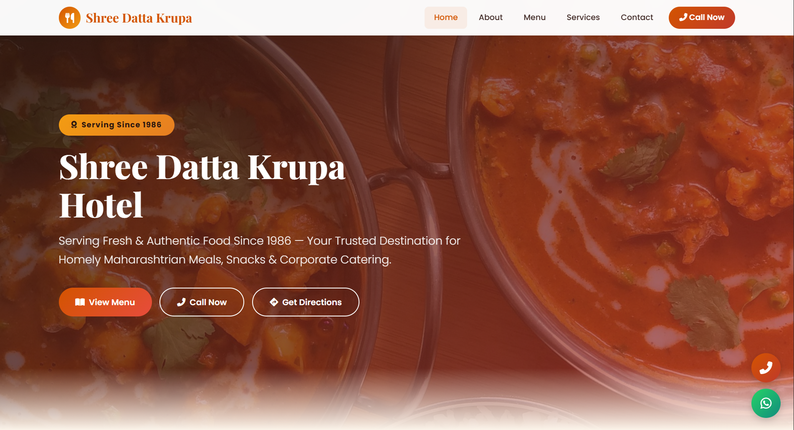
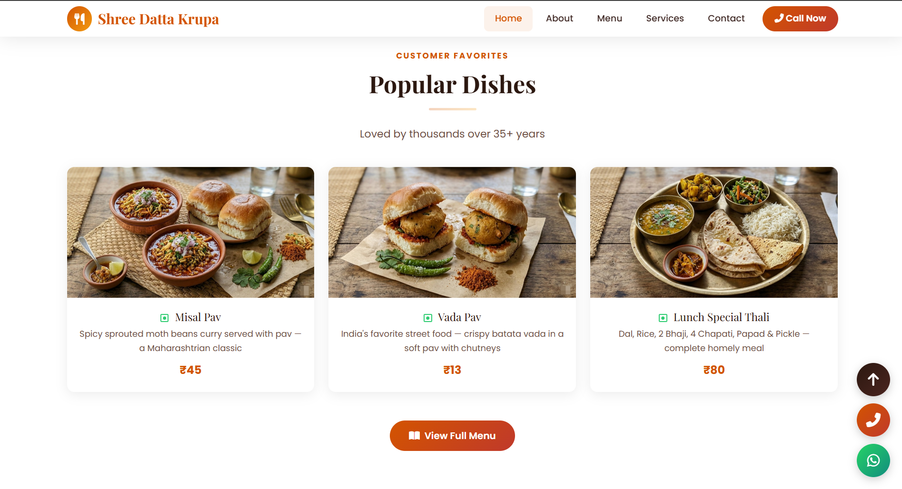
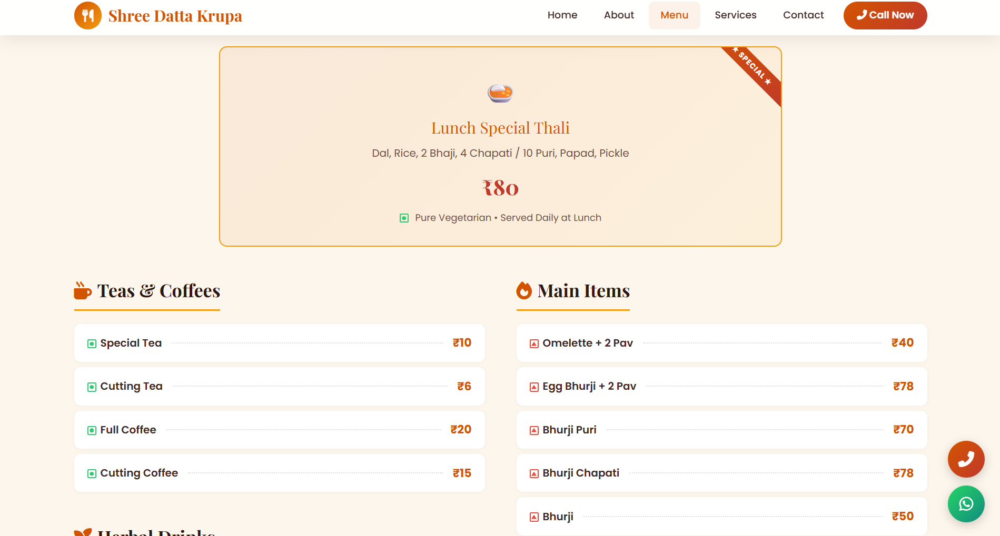
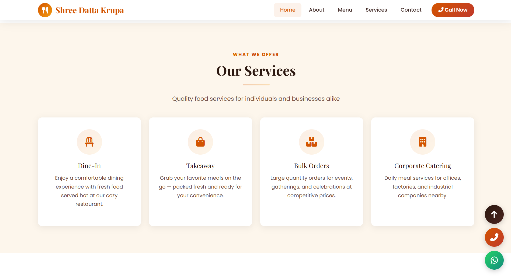
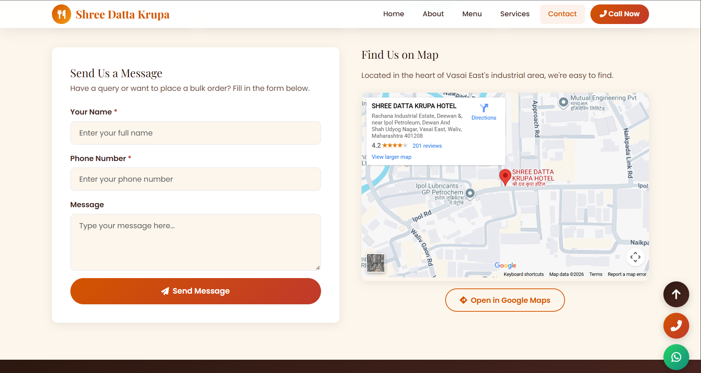

# 🍽️ Shree Datta Krupa Hotel — Website

Official website for **Shree Datta Krupa Hotel**, a traditional Maharashtrian restaurant serving fresh, hygienic, and homely food since **1986** in Vasai East, Maharashtra, India.

🔗 **Live Site:** [https://nikhil-8405.github.io/ShreeDattaKrupaHotel/](https://nikhil-8405.github.io/ShreeDattaKrupaHotel/)

---

## 📸 Preview

<p align="center">
  &nbsp;
  
</p>
<p align="center">
  &nbsp;
  
</p>
<p align="center">
  
</p>

---

## 🌟 Features

- **Responsive Design** — Looks great on mobile, tablet & desktop
- **Full Menu** — Complete menu with prices (Tea, Snacks, Misal, Lunch Thali, Egg Items & more)
- **Google Maps Integration** — Embedded map with correct hotel location
- **Google Reviews Section** — Display real ratings (4.2★ / 200+ reviews) with links to read & write reviews
- **Contact Form** — Sends enquiries directly to the hotel's email via Web3Forms
- **Click-to-Call & WhatsApp** — Floating buttons for instant customer contact
- **Services Page** — Dine-in, Takeaway, Bulk Orders & Corporate Catering info
- **About Page** — History and story of the hotel since 1986
- **Smooth Animations** — Scroll-based fade-in and slide effects
- **Preloader** — Loading animation for polished UX

---

## 🛠️ Tech Stack

| Technology | Purpose |
|---|---|
| HTML5 | Structure & content |
| CSS3 | Styling, animations, responsive design |
| JavaScript | Interactivity, form handling, scroll effects |
| Bootstrap 5 | Grid system, components, responsiveness |
| Font Awesome 6 | Icons |
| Google Fonts | Playfair Display & Poppins typography |
| Web3Forms | Contact form email delivery |

---

## 📁 Project Structure

```
ShreeDattaKrupaHotel/
├── index.html          # Home page
├── about.html          # About us page
├── menu.html           # Full menu with prices
├── services.html       # Services offered
├── contact.html        # Contact form, map & details
├── css/
│   └── style.css       # All styles
├── js/
│   └── main.js         # All JavaScript
└── images/
    ├── favicon.svg
    ├── MissalPav.png
    ├── VadaPav.png
    └── LunchSpecialThali.png
```

---

## 📍 Hotel Details

| | |
|---|---|
| **Name** | Shree Datta Krupa Hotel (श्री दत्त कृपा हॉटेल) |
| **Address** | Rachana Industrial Estate, near Ipol Petroleum, Vasai East, Maharashtra 401208 |
| **Phone** | [7387194116](tel:7387194116) |
| **WhatsApp** | [Message Us](https://wa.me/917387194116) |
| **Timings** | Mon–Sat: 8:30 AM – 9:30 PM |
| **Closed** | Sunday |
| **Google Rating** | ⭐ 4.2 (200+ reviews) |

---

## 🚀 How to Run Locally

1. Clone the repository:
   ```bash
   git clone https://github.com/Nikhil-8405/ShreeDattaKrupaHotel.git
   ```
2. Open `index.html` in your browser, or use VS Code Live Server extension.

---

## 📝 License

This project is for **Shree Datta Krupa Hotel, Vasai East**. All rights reserved.

---

<p align="center">
  Made with ❤️ for Shree Datta Krupa Hotel — Serving the community since 1986
</p>
